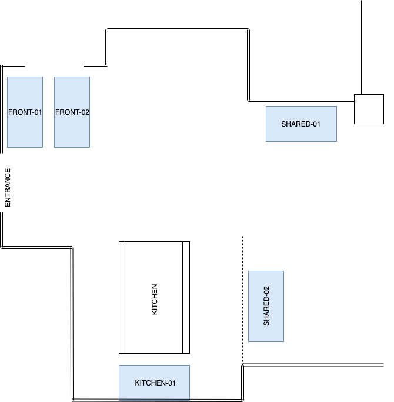

# Dronningens Screens

This repository keeps all current configurations for public displays in Dronningens, a shared office space in Oslo, Norway.

We utilize [Chrome Sign Builder](https://chrome.google.com/webstore/detail/chrome-sign-builder/odjaaghiehpobimgdjjfofmablbaleem) to schedule and deploy content to different screens.

Dronningens use Google Chrome Management for ChromeOS with Chrome hardware on screens that all has 1920x1080 resolution. The screens available are:

| Screen Name | Location                          | Used for      | Notes              |
| ----------- | --------------------------------- | ------------- | ------------------ |
| FRONT-01    | Entrance /w door top              | Trains        |                    |
| FRONT-02    | Entrance /w door bottom           | Ruter         |                    |
| KITCHEN-01  | In kitchen, front of table        |               | Has Chromecast     |
| SHARED-01   | Common screen in centre of office | Google Trends |                    |
| SHARED-02   | Common screen in center of office |               | Not regularly used |
